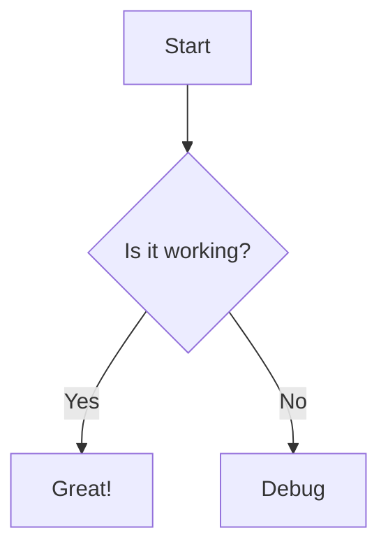
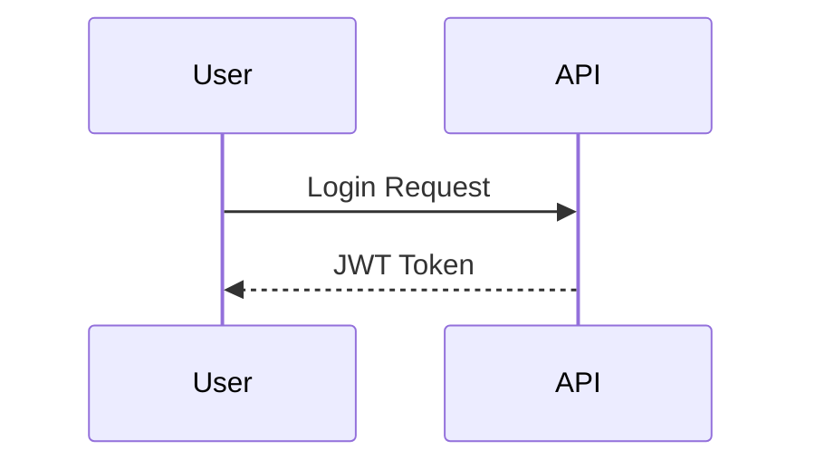

# Mermaid Diagrams

Mermaid is a JavaScript-based diagramming and charting tool that renders Markdown-inspired text definitions to create and visualize diagrams. It is especially useful for documenting workflows, processes, and system architectures directly within Markdown files.

## Flowchart Example

Below is a simple flowchart created using Mermaid syntax:

## Sequence Diagram Example

Mermaid also supports sequence diagrams, which are useful for visualizing interactions between different components or users:

## How to Use Mermaid in Markdown

1. Use triple backticks followed by `mermaid` to start a Mermaid code block.
2. Write your diagram definition inside the block.
3. Close the block with triple backticks.

> **Note:** Rendering of Mermaid diagrams depends on your Markdown viewer or editor. Some platforms (like GitHub) may not render Mermaid diagrams natively, but tools like VS Code with the appropriate extensions can display them.

For more information, visit the [Mermaid documentation](https://mermaid-js.github.io/mermaid/#/)